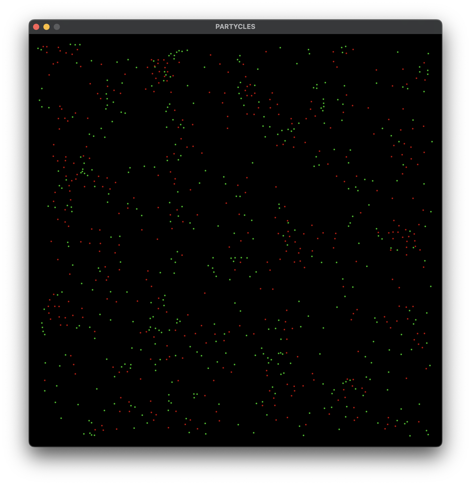
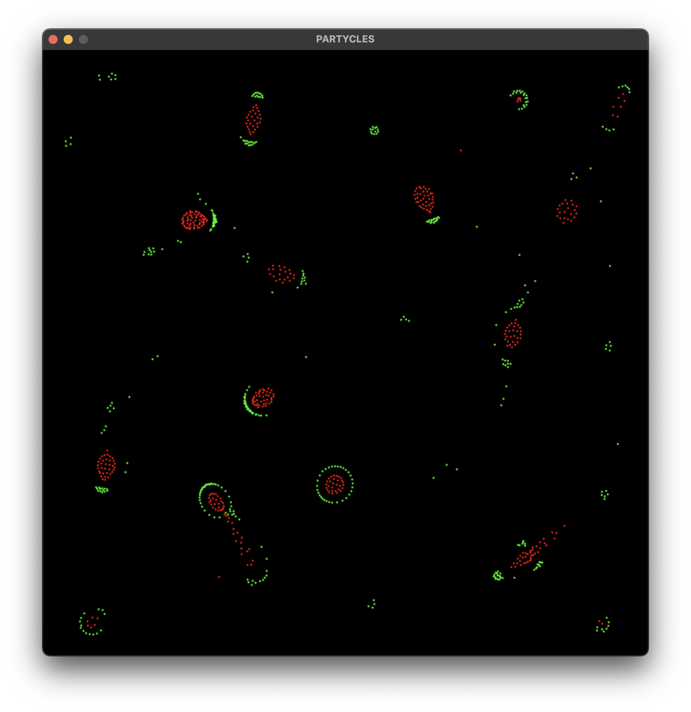
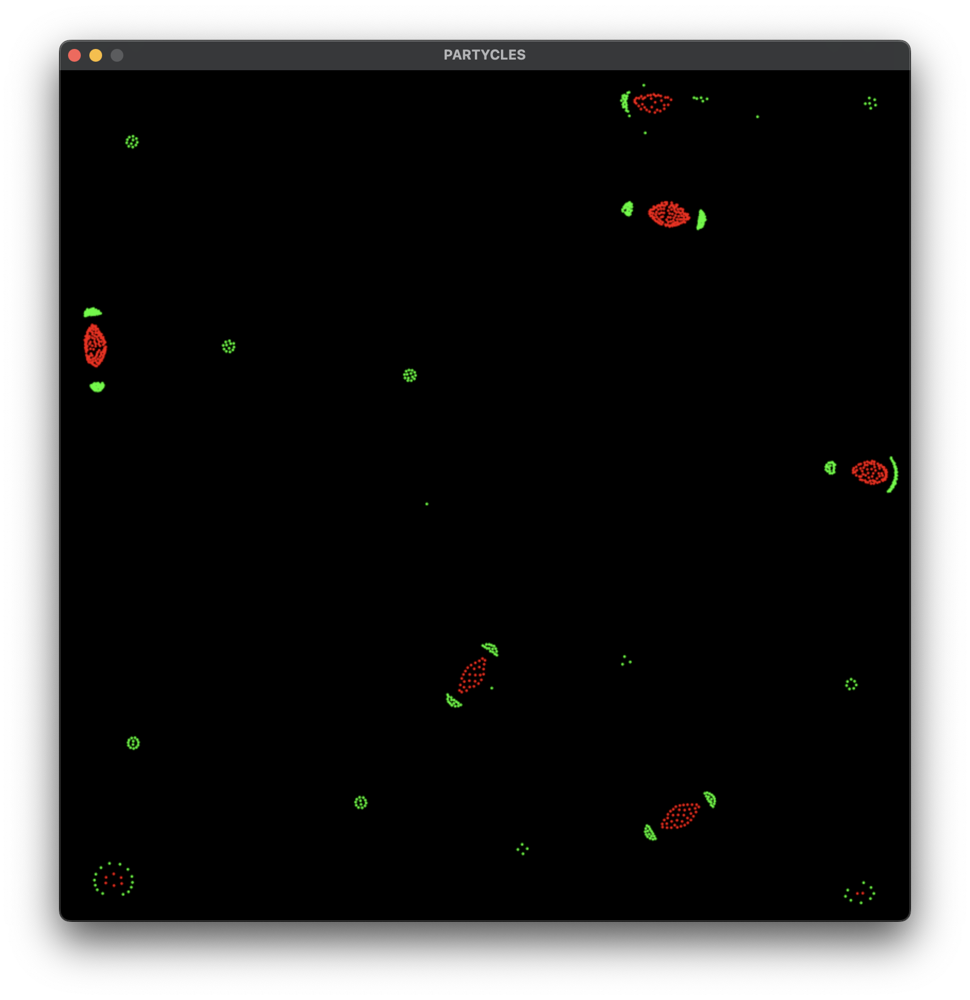

# PARTYCLES

Python implementation of particle life.

Performance is not great, I attempted to make it better with Quadtree but
that turns out to be a bad choice for situations where loads of particles are
grouped close together (which happens a lot). So I settled on a spatial hash
which is theoretically `O(n)` (I think?).

Either way it still gets way below 30FPS (5-20) on my M1 MacBook Pro. It gets
worse as the simulation progresses and more particles are near other particles.

The implementation of a Quadtree is pretty complete and is basically an
implementation of the
[Wikipedia page for Quadtrees](https://en.wikipedia.org/wiki/Quadtree) which
runs in `O(n log n)` time.

But as I said, I ended up using
[Spatial Hashing](https://www.gamedev.net/tutorials/programming/general-and-gameplay-programming/spatial-hashing-r2697/)
instead which is `O(n)` (best possible?).

Basically anything is better than all particles examining all other particles
which is `O(n^2)`. 1,000 particles = 1,000,000 cycles. 100,000 particles =
10,000,000,000 cycles!

## Install

```sh
python3 -m venv venv
source venv/bin/activate
pip install -r requirements.txt
python3 main.py
```

## Screenshots







## License

Do what you want!
